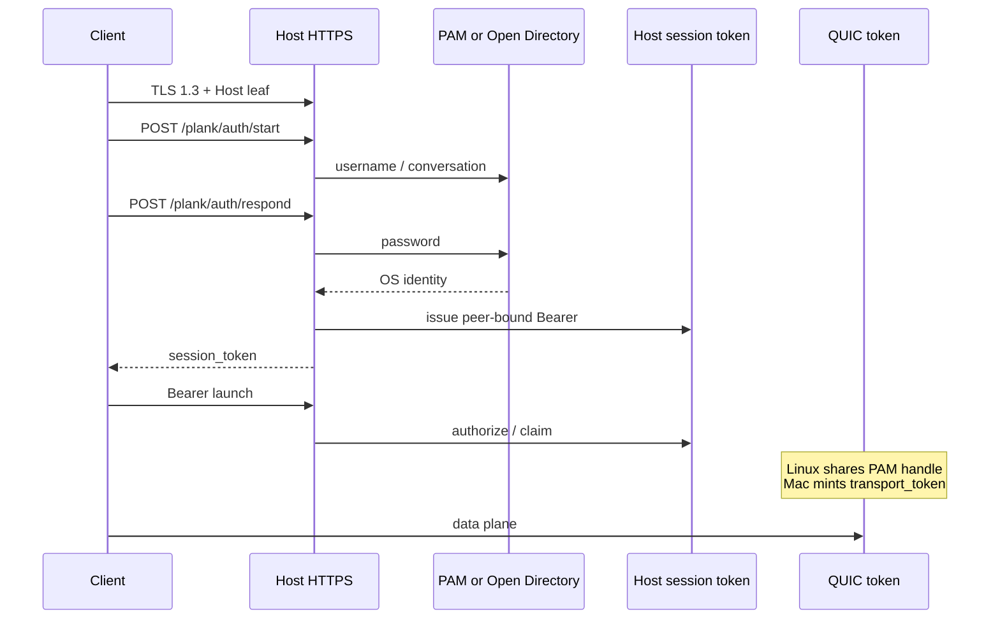
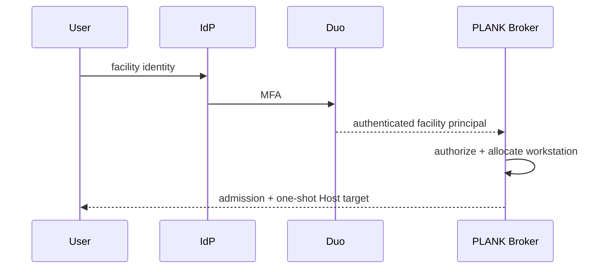
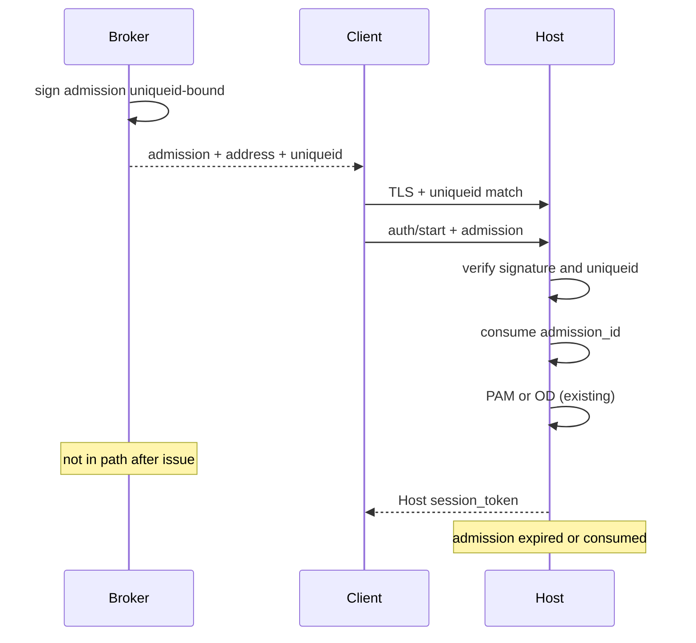
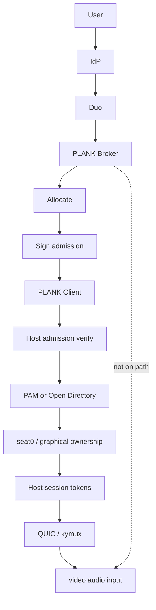
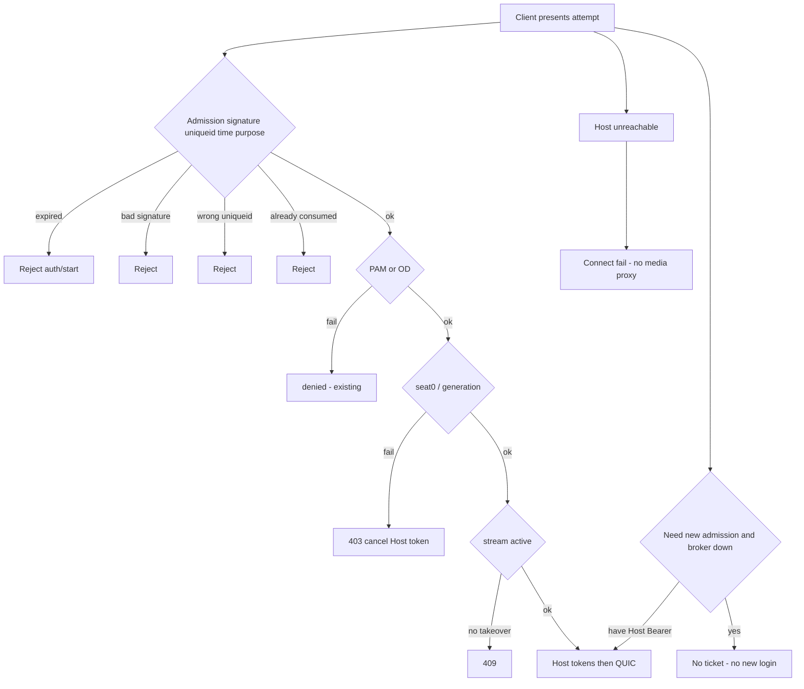

# PLANK Broker — Admission and trust design

**Status:** Design only. No code, branch, protocol, or broker service.

**Date:** 2026-09-20

**Checkout:** `jgeehreng/plank` (fork of `instinctual/plank`), branch `uppercut/studio`. Prior architecture review: `docs/development/investigations/plank-broker-architecture-review.md`.

**Rule:** The current repository is authoritative. If that review and the source disagree, the source wins. Discrepancies are listed explicitly below.

**This document answers:** What is a broker admission, how does PLANK trust it, and how does it coexist with Host PAM / Open Directory and existing authorization?

**Non-goals:** Do not implement the broker, Duo, protocol changes, REST endpoints, a database, a language choice, or an admin UI.

Intended architecture:

```text
                    CONTROL PLANE

User → Identity Provider → Duo MFA → PLANK Broker
  → authorization / workstation allocation / short-lived admission
  → PLANK Client
  → direct TLS + QUIC
  → PLANK Host
      → broker admission verification
      → PAM / Open Directory
      → seat0 / graphical ownership
      → existing PLANK session authorization


                    DATA PLANE

PLANK Client ═════════════════════════════ PLANK Host
              video / audio / input
```

The broker must not proxy video, audio, input, QUIC, kymux, NvFBC, VideoToolbox, Wacom, or the existing media transport.

---

## Source check vs the previous report

The current tree still matches the previous investigation on Host identity, Client non-identity, HTTPS-then-QUIC, peer-IP binding, and “no facility broker.” These points **disagree** with the earlier wording; **source wins**:

1. **Linux `session_token` is not strictly one-use.** `web_auth_manager_t::claim()` moves the PAM conversation to a `weak_ptr` on first claim and lets later same-peer claims share it. The token map entry lives until 300 s expire, `cancel()`, or `identity()` sees both the conversation gone and the weak_ptr expired. Mac `claimToken:` **does** remove the HTTP token and mint `transport_token`.
2. **Linux token expiry is wall-clock from authentication, not “until last stream.”** `expire_locked()` drops token entries at 300 s even after claim. Streams can keep the PAM `shared_ptr`; later HTTPS Bearer calls fail and need a new login.
3. **`start_desktop` omitted defaults true** in this fork (`read_start_desktop`). `false` is the logout-reconnect path so PAM must not skip GDM.
4. **Mac “admission” in `agent-connection.m` is machine XPC of the graphical agent** (generation + ~2 s ack deadline). It is not a facility ticket. Same word, different object.

---

## A. Executive conclusion

Recommend **Model A — broker authorizes an attempt**.

A broker admission is permission to **attempt** a Host connection. It does not authenticate the OS user, grant seat0 ownership, or start a PLANK stream.

The Host remains the only place that:

- authenticates the OS account (Linux PAM via `plank-pam-broker`; Mac Open Directory via `ODRecord verifyPassword:` + UID/UUID),
- authorizes the live console (`supervisor_attests_account_for_active_seat0` / `plank_macos_account_may_attach`),
- issues Host session tokens,
- owns stream reservation, takeover, and QUIC.

The broker admission is a **new, distinct, short-lived, workstation-`uniqueid`-bound, broker-signed object**. The Client presents it on the first HTTPS auth of a connection attempt. The Host verifies signature and binding **before** starting PAM/OD. After that, the existing handshake is unchanged.

Model B is rejected for the first implementation: the source already treats PAM/`pam_acct_mgmt`/OD policy, NSS UID, and seat0 attestation as the desktop lock. A broker-asserted identity would become an application allowlist, which this product explicitly does not have.

---

## B. Current security model verified from source

| Fact | Where |
| --- | --- |
| No pairing, no client cert, TLS 1.3 + cert profile | `protocol/authentication.md`; Client `isPlankCertificate()` |
| Host workstation id is persisted `uniqueid` | Linux `nvhttp.cpp` `file_state` / `http::unique_id`; Client bookmark `NvComputer::uuid` |
| Host TLS leaf is HTTPS and QUIC identity | `httpcommon.cpp` `create_creds`; `generate-plank-certificate.sh`; transport README |
| `PlankWorkerInstance` is process-local | `nvhttp.cpp` `worker_instance_id()` |
| Client has no crypto device identity | `NvHTTP::m_SessionToken` in-memory; bookmark stores Host id |
| Linux auth: HTTPS → delegated PAM socket | `web_auth.cpp`, `pam_broker_channel.h`, supervisor delegation |
| Mac auth: HTTPS → OD worker, identity is UID+UUID | `docs/architecture/macos-authentication.md`; `authentication-session.m` |
| Peer bind is accepted TCP address, not a header | `authentication_peer()`; Mac `https-auth-server.m` |
| Conversation 120 s; HTTP token 300 s | `web_auth.h`; Mac record `expires = +300` |
| Mac claim is one lease, 15 s to activate | `authentication-session.h/.m` |
| Desktop ownership is seat0 / graphical generation | `session_context.cpp` `supervisor_attests_account_for_active_seat0`; `account-policy.h` |
| Launch is Desktop-only; 409 or explicit takeover | `nvhttp.cpp` launch/resume |
| This fork can start a user session after PAM | `maybe_start_user_session_after_pam`; `start_desktop` default true |
| Disconnect does not imply a free workstation | `e76cc92`; Desktop reservation can outlive media |
| README: direct connect, no facility broker | `README.md` Connectivity |

---

## Model A vs Model B

### Model A — authorize an attempt

Broker: *facility principal P may attempt Host W until T.*  
Host: verify admission → existing PAM/OD → existing ownership → existing tokens → QUIC.

| Concern | Interaction |
| --- | --- |
| PAM | Still runs `pam_authenticate`, `pam_acct_mgmt`, `pam_setcred`, `pam_open_session`. HBAC stays in SSSD/FreeIPA. |
| Open Directory | Still `verifyPassword:` + UID/UUID + `mbr_uid_to_uuid`. Admission is not an OD grant. |
| seat0 | Unchanged: greeter any non-root; user desktop UID must match attestation. |
| Graphical generation | Unchanged. Mac tokens still die on generation change. |
| Desktop-only | Unchanged at launch. |
| Host session tokens | Still issued only after PAM/OD. Admission never becomes Bearer or Kyber `ClientAuth`. |
| Takeover | Still Host feature flag + explicit request + same PAM owner. |
| Linux/Mac | Same admission object; different verify hook before `web_auth->begin` / `startForPeer`. |
| Duo | Protects **broker login and allocation**, not Host OS login. |
| Facility authz | Broker decides *which workstation to attempt*. Host decides *whether that OS account may own this console*. |

**Cost:** the artist still types (or uses a cached username) the Host password. Duo does not replace Host PAM. Two identity domains (facility vs OS) remain.

### Model B — broker authenticates the user

Broker: *this person is already authenticated; Host should trust that.*  
The Host would have to treat admission as a login.

| Concern | Interaction |
| --- | --- |
| PAM | `pam_acct_mgmt` / `open_session` skipped or faked. FreeIPA HBAC no longer sees a real conversation. |
| Open Directory | OD policy and UID/UUID proof disappear unless the Host re-queries directory **without** a password — that is a new Host identity model, not a small hook. |
| seat0 | Host would need a broker-supplied UID. That is an application allowlist. `AGENTS.md` and `protocol/authentication.md` forbid that. |
| Graphical generation | A broker token cannot bind Mac generation; the Host still must. Model B invites “token survived a logout” bugs. |
| Host tokens | Would be minted from broker assertion. One stolen admission becomes a stream. |
| Takeover | Broker would be tempted to encode takeover; Host 409 logic would be bypassed or duplicated. |
| Linux/Mac | Mac identity is UUID, not username. A broker username claim does not satisfy `plank_macos_account_may_attach`. |
| Duo | Looks like SSO, but then Host PAM 2FA (if any) is either doubled or removed. Removing it is the whole risk. |
| Facility authz | Collapses into Host login. A broker bug is a studio-wide workstation login. |

**Source reason Model B is wrong for v1:** `authenticated_account_uid_for_desktop` cancels the Host token if NSS UID fails seat0 attestation. Ownership is derived from a **PAM-authenticated username**, not from a network assertion. Mac stores `record.account` from OD, then `authorizeToken` re-checks `plank_macos_account_may_attach` against a live snapshot. There is no Host path that accepts an external “this user is logged in.”

Model A is preferred because the source **has no safe insertion point for Model B** without replacing those functions. That is not simplicity; it is compatibility with the actual lock.

---

## C. Admission semantics

An admission means exactly:

> Facility principal **P** may **attempt a PLANK HTTPS authentication** to workstation **W** (`uniqueid`) until **T**, for purpose **`connect-attempt`**.

It does **not** mean: OS login, desktop ownership, stream ownership, takeover, `start_desktop`, display layout, or media access.

### What it should not constrain

| Candidate | Include? | Why not |
| --- | --- | --- |
| Application | No | Host already rejects non-Desktop (`proc::is_desktop_app`). |
| Project | No | Allocation/UX on the broker. Host has no project object. |
| Session type | No | Only Desktop exists. |
| Client identity / pubkey | No | Client has none. Inventing one is a new PKI, not required for Model A. |
| Source IP / network | No | Volatile; Host already binds **Host** tokens to TCP peer. Binding admission to IP breaks VPN/NAT and the reconnect path. |
| Display / topology | No | Host launch validation already owns this. |
| Takeover | No | Host already requires explicit flag + same owner. Encoding it would override 409. |
| `start_desktop` | No | Host/Client already exchange this after PAM. Broker must not skip-GDM by ticket. |
| Reconnect | No | Current reconnect is in-memory Host password + existing Bearer. See broker outage. |
| OS username as grant | No | Mapping facility → OS account is Host PAM/OD. Embedding it as authorization recreates an allowlist. |

Optional **non-authorizing** Client hints (not Host-enforced grants): reachability address, optional TLS fingerprint for pin, `expires_at` for UI.

---

## D. Admission schema

Conceptual object. Not JWT, PASETO, or REST. Encoding comes later.

| Field | Exist? | Why | Created by | Verified by | Security? | Omit? |
| --- | --- | --- | --- | --- | --- | --- |
| `issuer` | Yes | Which broker/key issued it; rotation | Broker | Host (known issuer/key id) | Critical | No |
| `key_id` | Yes | Select verification key without one global key | Broker | Host | Critical | No |
| `admission_id` | Yes | Replay/consume log; allocation correlation | Broker (unique) | Host (seen-set until expiry) | Critical | No |
| `subject` | Yes | Facility principal (IdP id), **audit only** | Broker from IdP | Host must **not** use as UID | Informational on Host; critical on Broker | Do not omit on Broker; Host ignores for authz |
| `workstation_uniqueid` | Yes | Bind to one Host | Broker from directory | Host vs `http::unique_id` / Mac UUID | Critical | No |
| `issued_at` | Yes | Reject future/skew | Broker | Host clock + skew | Critical | No |
| `expires_at` | Yes | Short window | Broker | Host clock + skew | Critical | No |
| `purpose` | Yes | Must be `connect-attempt` | Broker | Host exact match | Critical | No |
| `audience` | Yes | `plank-host` | Broker | Host | Critical | Can merge with purpose; keep one of them |
| `signature` | Yes | Broker private key | Broker | Host with pinned public key | Critical | No |
| OS username | **No** as grant | Host PAM maps name→UID | — | — | Would be critical if present | Omit |
| Client id / pubkey | **No** | No Client key exists | — | — | — | Omit |
| Host address | Client hint only | How to dial 28989 | Broker directory | **Client**, not Host | Informational | Yes for Host verify |
| Host TLS fingerprint | Client hint only | Pin expected leaf | Broker inventory | **Client** before send password | Informational for Host | Optional |
| Project / app | No | See semantics | — | — | — | Omit |
| Session id | No | Session does not exist yet | — | — | — | Omit |
| Takeover / start_desktop | No | Host/Client already | — | — | — | Omit |

**Facility identity → OS account:** Broker may know a mapping for “offer Alice workstation 17 because she owns that desk.” That mapping is **allocation policy**, not an admission grant. The artist still authenticates as the OS account the Host PAM/OD accepts. If those identities differ, that is an IdP/HR problem, not a Host bypass.

---

## E. Trust model

How the Host knows the admission came from the authorized broker.

| | A. Broker signs, Host has pubkey | B. Per-Host shared secret | C. Host↔Broker mTLS at verify | D. Other |
| --- | --- | --- | --- | --- |
| Provisioning | Install broker pubkeys on Host (`key_id`) | Unique secret per Host or one studio secret | Host client cert + broker CA | e.g. Host polls broker |
| Distribution | One public key (or small set) to every Host | N secrets or one secret = one blast radius | PKI both ways | Online dependency |
| Rotation | New `key_id`; Hosts keep old until expiry drain | Touch every Host secret | Recertify Hosts | — |
| Compromise | Stolen broker **signing** key forges all admissions | Per-Host secret: one Host; shared secret: all Hosts | Stolen Host client cert: impersonate that Host to broker, not forge admissions | — |
| Replay | Need `admission_id` + TTL | Same | Same + online | — |
| Revocation | TTL + optional later deny list | Same | Natural online check | — |
| Offline verify | **Yes** | Yes (HMAC) | **No** | Usually no |
| Broker outage after issue | **Connect still works** | Same | **Connect fails** | Fails |
| Multiple brokers / staging | Multiple `issuer`+`key_id` | More secrets | More CAs | — |
| Linux/Mac | Same verify primitive before PAM/OD | Same | Need outbound Broker reachability from every Host | — |
| Complexity | Moderate, matches current “admin installs Host TLS” | Looks simple, scales badly | High, couples availability | — |
| Blast radius | Signing key = all managed Hosts | Shared secret = same; unique secret = one Host | Broker CA = control plane | — |

**Recommendation: Option A** (broker-signed admission, Host-pinned public keys, `key_id`).

Hybrid that is appropriate later, **not** for admission verify:

- Host→Broker **occupancy/heartbeat** channel (can be mTLS) so allocation is not blind.
- Optional revocation documents fetched on a timer — **never** on the QUIC/media path, **never** required to accept a still-valid unexpired signature during a broker outage.

Do not use Option C as the admission check: it makes “broker goes offline after issue” a connect failure and puts the broker in the Host auth hot path.

Do not use one studio-wide HMAC (Option B shared): same blast radius as a signing key, worse rotation, no `key_id` story.

---

## F. Replay, expiration, revocation

### If an attacker has a valid admission

| Abuse | Outcome under this design |
| --- | --- |
| Reuse later | Fails after `expires_at` (+ skew). |
| Use on another Host | Fails: `workstation_uniqueid` ≠ that Host’s persisted UUID. |
| Use after intended session starts | Host `admission_id` already consumed. Existing Host Bearer is a different object and is peer-bound. |
| Use without OS password | Model A: PAM/OD still required. Admission alone is not a desktop. |

### Properties

| Property | v1? | Tradeoff |
| --- | --- | --- |
| Short-lived | **Yes** | Minutes-class, similar to the 300 s unclaimed Host token. Limits stolen-ticket window. |
| Workstation-bound | **Yes** | `uniqueid`, not IP. |
| Independently verifiable | **Yes** | Signature; broker need not be online. |
| One-use on Host | **Yes, on first successful `auth/start`** | Stops two Clients sharing one ticket. Does not replace PAM. |
| Bound to a Client device | **No** | No Client key; would fail NAT/shared seats for no gain under Model A. |
| Bound to a PLANK session | **No** | Session does not exist yet. After PAM, Host tokens take over. |
| Broker contact to verify | **No** | Outage and media-path independence. |

**Consume rule:** Host records `admission_id` until `expires_at` + skew after it accepts `auth/start`. A second `auth/start` with the same id fails. Launch/resume using an already-issued Host Bearer do **not** present or re-consume admission.

**Clock:** Host wall clock + skew (order of a few minutes). `issued_at` in the future beyond skew → reject. Operational requirement: Hosts need sane time (already implicit for TLS). Do not use the Host’s **monotonic** token clock for admission (those clocks are process-local).

### Revocation

| Event | Mechanism |
| --- | --- |
| Admission stolen | TTL + consume. Optional later deny of `admission_id`. |
| User loses workstation permission | Next broker allocation fails. **Existing Host session continues** until Host revoke/PAM/desktop change (Model A). |
| IdP/Duo disabled | Cannot get a new admission. Live Host session unchanged until Host policy says otherwise. |
| Admin kill live stream | Host already has `terminate_sessions` / Mac `revokeAll`. Broker may later *request* that on a control channel; not an admission feature. |
| Workstation quarantined | Broker stops allocating. Host local flag can refuse new `auth/start` even with a leftover ticket. Live media: Host terminate. |
| Broker signing key compromised | Rotate `key_id`; Hosts drop old key; all outstanding admissions die. |
| Host compromised | Attacker has that Host’s TLS and desktop; cannot forge admissions for other uniqueids. |

Online-only “Host asks Broker every connect” is rejected: broker outage becomes a studio outage, and it invites putting the broker on the session path.

Offline-only is acceptable for v1 if TTL is short. Hybrid deny-lists are a later control-plane add-on.

---

## Broker outage

| Situation | Required online? | Behavior |
| --- | --- | --- |
| Issue new admission | Broker **yes** | No ticket, no new attempt on managed Hosts. |
| Client already has unexpired admission, Broker dies | Broker **no** | Host verifies locally; PAM proceeds. |
| Media / QUIC in progress | Broker **no** | Broker is not on the path. |
| Existing Host Bearer still valid | Broker **no** | Launch/resume/topology as today. |
| Reconnect while Host Bearer or in-memory password retry window is alive | Broker **no** | Current Client retries Host auth; do **not** demand a new admission for Bearer-authenticated requests. |
| New login after Host token dead (300 s / revoke / logout) | Broker **yes** if Host is broker-enforced | No admission → Host refuses `auth/start`. |
| Allocation / occupancy update | Broker yes | Stale occupancy is an allocation problem, not a media outage. |

The media plane must not depend on the Broker remaining reachable.

---

## G. Client integration

The Client receives a **one-shot connection target**, not a persistent broker session object and not a Client device identity.

Minimum bundle:

1. **Admission** (opaque to the Client except “send this to the Host”).
2. **Host address** (what to dial; TCP+UDP 28989 as today).
3. **`workstation_uniqueid`** (must match `/serverinfo` `uniqueid` / `NvComputer::acceptsServerUuid`).
4. **`expires_at`** (do not start a hopeless connect).
5. **Optional TLS fingerprint** (pin before sending a password).

Client behavior:

```text
Broker bundle
  → ephemeral bookmark (address + uniqueid + pin)
  → TLS 1.3 + cert profile + uniqueid match
  → present admission on first /plank/auth/start
  → existing PAM/OD conversation
  → existing Host Bearer
  → existing launch / QUIC
```

Do not keep a broker-issued session object across days. Do not invent a Client private key. After Host Bearer exists, reconnect uses **current** `PlankReconnectPolicy` + in-memory password, not a new broker round-trip, until that Host conversation is gone.

If `/serverinfo` uniqueid ≠ bundle uniqueid, **stop**. That is redirect protection.

---

## H. Linux Host integration

Cleanest verify point: **`nvhttp.cpp` `auth_start`**, after JSON/username parse, **before** `web_auth->begin()`.

```text
HTTPS request
  → authentication_peer()
  → if host requires admission: verify signature, uniqueid, purpose, time, consume admission_id
  → web_auth->begin(username, peer)     // existing PAM
  → maybe_start_user_session_after_pam  // existing fork behavior
  → later: authenticated_account_uid_for_desktop
  → launch reservation / claim() / QUIC
```

Why not later:

- At launch only: PAM would run for unauthorized facility users (conversation cost + password oracle).
- Inside `web_auth_manager_t`: mixes facility tickets with PAM token maps.
- Inside `session_context`: that module attests seat0, not network credentials.
- Inside `session_stream`: too late; reservation already means “authorized launch.”

`session_context` / `session_stream` stay unchanged for v1.

Enforcement is a **Host local policy** (standalone vs broker-managed), not a protocol flag from the Client.

---

## I. macOS Host integration

Cleanest verify point: **`https-auth-server.m` auth start**, **before** `PLANKMacAuthenticationSession startForPeer:`.

```text
Accepted TLS peer bytes
  → if host requires admission: same conceptual verify/consume
  → startForPeer / respondForPeer          // OD
  → authorizeToken + graphical snapshot
  → claimToken → transport_token
  → machine admission / graphical authority unchanged
```

Do **not** put facility admission into `agent-connection` machine admission or `PLANKMacGraphicalAuthority`. Those bind the console agent. Mixing them would make a stolen facility ticket look like a console generation.

Mac and Linux share one admission contract. They do not share implementation code.

---

## Existing tokens — do not collapse

| Object | Owner | Role | One-use? | Leaves Host? | v1 change? |
| --- | --- | --- | --- | --- | --- |
| Linux HTTP `session_token` | Host `web_auth` | After PAM; peer-bound Bearer | No (share until expire/cancel) | Client memory only | Unchanged |
| Linux PAM conversation / `launch_session_t::authentication_session` | Host | Open PAM lifetime | Held by streams | **Never** (Unix socket) | Unchanged |
| Linux launch reservation | Host `session_stream` | Gap-fill before QUIC | Pending until setup | No | Unchanged |
| Mac HTTP `session_token` | Host auth session | After OD; peer-bound | Yes at `claimToken:` | Client memory | Unchanged |
| Mac `transport_token` | Host stream lease | QUIC auth after claim | Yes; 15 s to activate | Client for QUIC only | Unchanged |
| Mac machine admission generation | Host agent XPC | Agent may run | Deadline-bound | No | Unchanged |
| Kyber `ClientAuth` | Transport | QUIC app token | Connection-scoped | On QUIC | Unchanged |
| **Broker admission** | **Broker** | **Attempt Host auth** | **Yes at Host `auth/start`** | **Client → Host once** | **New** |

The broker owns **only** the last row.

---

## J. Allocation / occupancy semantics

Broker must know enough to **not** hand two artists the same controlling attempt. It does not need a full CMDB in this document.

Minimum directory fields (conceptual):

- `workstation_uniqueid` (stable)
- Reachability hint (address, not identity)
- Host TLS fingerprint (optional pin)
- Broker-enforced vs standalone
- Occupancy state (below)
- Host version / capabilities (allocation filter only)
- Optional: last known OS desktop owner (from heartbeat, not from admission)

**`PLANK disconnected` ≠ available** on this fork. Media can stop while the user desktop and Desktop reservation remain.

| State | Meaning |
| --- | --- |
| `offline` | No usable Host inventory/heartbeat. Do not allocate. |
| `quarantined` | Admin hold. Do not allocate. |
| `available` | Host reachable; no outstanding reservation; no active PLANK stream; console is greeter **or** policy explicitly allows this facility user to attempt the **already occupied** desktop (then Host PAM + ownership still apply). |
| `reserved` | Unexpired admission outstanding; Client not yet consuming. |
| `connecting` | Host accepted `auth/start` (consumed) but no stream yet. |
| `in_use` | Active PLANK stream (or pending launch reservation). |
| `disconnected_occupied` | No stream; OS desktop still that user’s. Not `available` unless policy is “same user may resume.” |

Authoritative stores:

- **Broker** is authoritative for `reserved` (who may attempt).
- **Host** is authoritative for stream, seat0, and whether PAM succeeds.
- Conflict: two valid admissions must be prevented **at the broker**. If it still happens, Host 409/takeover remains the backstop — not a substitute for atomic allocate.

### Atomic allocation (design only)

```text
allocate(W):
  if state not available (per policy): deny
  atomically reserved += admission
```

| Race | Resolution |
| --- | --- |
| A and B request W | One `reserved`; the other denied. |
| Allocation succeeds, Client never connects | `expires_at` → reservation drops. Host consume-set expires too. |
| Admission expires | Workstation leaves `reserved`. Occupancy may still be `disconnected_occupied`. |
| Client disconnects, desktop remains | `disconnected_occupied`. Same user may get a new admission if policy allows resume; a different user must not be told `available`. |

---

## K. Duo boundary

Duo protects **broker login and broker-side administrative actions** (allocate, revoke reservation, quarantine, key rotation approval).

| Placement | Consequence |
| --- | --- |
| Duo on broker login | Facility user is a person. Stolen VPN + bookmark is not enough to get an admission. |
| Duo on each Host PAM | Independent studio PAM policy. Not required by this contract. Doubling Duo + broker Duo will fail artists on reconnect. |
| Duo on media / QUIC | Forbidden. No broker/Duo in the data plane. |
| Duo on admin broker ops | Prevents a stolen broker console from mass-allocating. |

Reconnect inside the Host token/password window should **not** re-challenge Duo. A new admission after Host token death may re-challenge Duo at the broker.

---

## L. Threat model

| Threat | Result | Mitigation |
| --- | --- | --- |
| Steal admission | Attempt that Host until T; still need OS password | Short TTL, uniqueid bind, consume, Model A |
| Modify admission | Host signature verify fails | Option A |
| Change Host address in bundle | Client dials wrong box; uniqueid/TLS mismatch if they send admission/password | Client must match uniqueid + cert profile/pin **before** password |
| Admission on other workstation | uniqueid fail | Binding |
| Steal Client machine | No Client key to steal. Gets leftover admission + maybe cached username + maybe in-memory password if session live | Short TTL; don’t persist admission; current password-in-memory risk is **existing** |
| Compromise Host | That workstation’s TLS + desktop. Cannot mint admissions for others | uniqueid + broker key stay off that Host’s media keys |
| Compromise Broker app | Can allocate and sign while keys live | Duo on admin; Host still PAM |
| Steal broker signing key | Forge admissions for every Host trusting `key_id` | Rotate keys; small key set; offline Hosts need a way to learn revocation of **keys** (config update) |
| Steal Host TLS key | MITM that Host; Client who don’t pin are exposed (**existing**) | Pin fingerprint in bundle; uniqueid still must match |
| Replay | Consume + TTL | See replay section |
| Clock skew | False reject or accept | Skew window; NTP |
| Broker outage | No new admissions; live sessions and unexpired tickets continue | Option A, no media dependency |
| Network partition Client↔Host | Existing: connect fails. Broker cannot help without becoming a gateway | Do not add a media hop |
| Network partition Host↔Broker | Occupancy stale; connect still works if ticket already issued | Heartbeat is allocation-quality, not session-critical |

---

## Linux / macOS consistency

| Concept | Linux | macOS |
| --- | --- | --- |
| Host identity | Persisted `uniqueid` in `plank-state.json`; TLS leaf | Persisted workstation UUID; TLS identity |
| User authentication | PAM via `plank-pam-broker` | Open Directory UID+UUID |
| Broker admission verify | Before `web_auth->begin` in `auth_start` | Before `startForPeer` on HTTPS auth queue |
| Existing authorization | seat0 attestation, Desktop-only, display lease UID | Graphical generation/phase, permissions |
| Session ownership | PAM UID + peer + stream/PAM handle | Account UUID + generation + one lease |
| Revocation | `cancel`, last stream, takeover, worker replace | `revokeToken` / `revokeAll`, generation latch |
| Session expiration | 120 s / 300 s Host tokens | 300 s HTTP; 15 s lease; 5 s HTTPS watchdog |
| Broker outage | Same contract: local verify; media independent | Same |
| Worker/process replacement | New `worker_instance_id`; same uniqueid + TLS | Agent/runtime replace; machine UUID stable |

**Shared:** admission schema, signature, uniqueid bind, Model A, consume-on-`auth/start`, no Client key.  
**Different:** PAM vs OD, Linux shareable Host token vs Mac one-lease, machine XPC admission (Mac-only, not this ticket).

---

## M. Backwards compatibility

Both modes can coexist **per Host**.

| Mode | Host policy | Client |
| --- | --- | --- |
| 1. Standalone (today) | Admission not required | Direct bookmark as now |
| 2. Broker-managed | Admission required on new `auth/start` | Broker bundle then direct Host |

- Host knows via **local administrator configuration**, not a Client-supplied flag (Client cannot opt out).
- Facility enables Hosts one at a time (install broker pubkey + require-admission).
- Unmanaged Hosts stay Mode 1.
- **Older Client → managed Host:** cannot present admission → `auth/start` fails closed. No silent fallback.
- **Newer Client → standalone Host:** omit admission; existing path. Extra admission on a standalone Host is ignored (do not fail; otherwise mixed estates break).
- Discovery `/serverinfo` should **not** need to advertise broker mode for security; enforcement is Host-side. A capability bit is optional UX only and is not a grant.

Do not change the wire of PAM start/respond, launch XML/JSON, or QUIC for this coexistence.

---

## N. Security invariants

1. A broker admission can never by itself grant desktop ownership.
2. A valid admission for workstation A cannot be used against workstation B.
3. The Broker never receives video, audio, input, QUIC, or passwords for Host PAM/OD.
4. The Host remains responsible for OS-level user authentication (PAM / Open Directory).
5. The media path does not depend on the Broker after the Host has accepted the attempt and issued its own tokens.
6. A worker-process replacement does not silently change workstation identity (`uniqueid` + TLS stay; `worker_instance_id` may change).
7. Host session tokens, Mac `transport_token`, and Kyber `ClientAuth` are not broker admissions and must not be reused as such.
8. Admission must not bind authorization to Client IP or Client device keys that do not exist.
9. Takeover, `start_desktop`, and Desktop-only remain Host rules.
10. Facility identity is not an OS UID.
11. Forwarded HTTP headers never select peer identity (existing) and never carry a substitute admission trust.
12. Standalone Hosts must keep working without a broker.

---

## Diagrams

### 1. Existing authentication



### 2. Proposed broker authentication



### 3. Proposed admission lifecycle



### 4. Full session (broker leaves the media path)



### 5. Failure cases



---

## O. Open questions

Only items still unresolved after source inspection:

1. **Reachability:** does the broker return an address the Client cannot already know (split DNS, jump host name), or only uniqueid + pin for a Client that is already on the studio network?
2. **Exact TTL and skew** — policy numbers, not architecture. Source only proves Host tokens use 120/300/15 s.
3. **Occupancy feed:** v1 can allocate without Host heartbeats (stale `disconnected_occupied`). When that feed exists, it must not become admission verify.
4. **Duo product shape** (prompt, SSO, which IdP claims) — deferred.
5. **Whether `disconnected_occupied` may be allocated to the same facility user automatically**, or only after an admin/artist “resume” action.
6. **How Hosts learn broker `key_id` revocation** when the broker is offline (config management is outside this repo).
7. **Suggested OS username as a Client prefill** — useful, but omitted from the ticket to avoid a grant. Still a UX choice, not a security field.

---

## P. Recommended implementation sequence (do not implement)

1. Accept Model A + signed uniqueid-bound admission + no OS-account grant.
2. Specify encoding and Host config (`require_admission`, pinned `key_id`s) — still not this step.
3. Linux `auth_start` verify/consume; tests around `test_web_auth` / nvhttp auth without changing PAM.
4. Mac HTTPS start verify/consume; do not touch graphical authority.
5. Client one-shot bundle + uniqueid/pin checks before password.
6. Broker allocate/reserve/expire state machine (separate product).
7. Occupancy heartbeat and admin revoke channel — after the above, still off the media path.

---

## What must not change

Native QUIC, kymux, FEC, exact-format encode/decode, Wacom raw-HID, Host TLS identity and cert profile, PAM / Open Directory, seat0 and graphical generation, Desktop-only, takeover semantics, worker replacement vs stable `uniqueid`, Host token lifetimes and peer bind, no UPnP, no ENet, no pairing restore, no user allowlist, no media proxy, no Client crypto identity invented for cleanliness, `plank-pam-broker` remaining a local PAM helper.

---

## Close (not “ready to implement”)

1. **Defined enough:** admission means Model A; schema and Host binding (`uniqueid` + signature, not IP); trust is broker-signed / Host-pinned keys; tokens stay distinct; verify sits **before** PAM/OD; media never depends on the broker; standalone and managed Hosts can coexist per Host.
2. **Unresolved:** reachability source, TTL numbers, occupancy heartbeat, Duo product, resume policy for `disconnected_occupied`, offline signing-key revocation distribution.
3. **Needed before Broker service design:** facility identity claims from the IdP; how Hosts get broker public keys; whether v1 occupancy is “best-effort directory” or requires a Host control channel.
4. **Stability:** the admission contract is **stable enough to proceed to Broker API / data-model design** if Model A and the invariants in section N are accepted. It is **not** an implementation go.

This file is an investigation note for review. It is not a protocol change and was not implemented.
