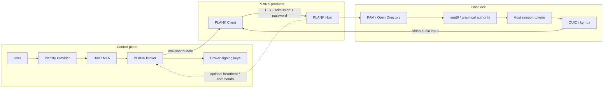
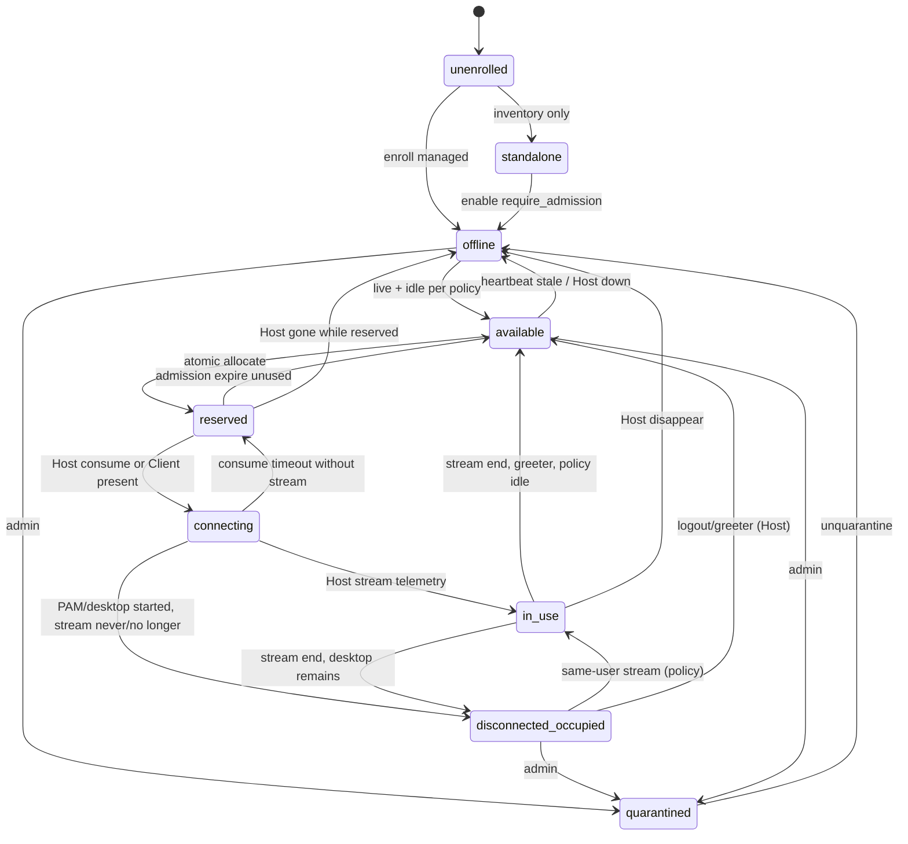

# PLANK Broker — API, state model, and data architecture

**Status:** Design only. No code, branch, protocol, Broker service, or technology lock-in.

**Date:** 2026-09-21

**Checkout:** `jgeehreng/plank` (fork of `instinctual/plank`), branch `uppercut/studio`.

**Baselines:**

- Architecture review: `docs/development/investigations/plank-broker-architecture-review.md`
- Admission/trust: `docs/development/investigations/plank-broker-admission-trust-design.md`

**This document answers:** What services, objects, APIs, state transitions, and trust relationships are required for a facility to manage a fleet of PLANK workstations, without replacing Host PAM/Open Directory or the direct Client↔Host data plane.

**Non-goals:** Language, database, IdP product, Duo SDK, REST vs gRPC, Kubernetes, cloud. Encoding of the admission blob is Prompt 4, not this document.

**Repo rule:** `AGENTS.md` — only Host and Client products belong in this public tree. The Broker is a separate control-plane product.

---

## Source verification (this pass)

No contradiction was found that would require redesigning Model A or the admission object.

Facts used below, with source:

| Fact | Source |
| --- | --- |
| No facility broker; direct Client→Host; TCP+UDP 28989 | `README.md` Connectivity |
| Only Host and Client in this public tree | `AGENTS.md` |
| Every new connection authenticates; no pairing; no client cert | `protocol/authentication.md` |
| Linux PAM via delegated `plank-pam-broker`; `allow_root_login` does not bypass ownership | `protocol/authentication.md`; `apps/host/linux/src/auth/pam_broker_channel.h`; `session_context.cpp` `supervisor_attests_account_for_active_seat0` |
| Linux `uniqueid` persisted in `file_state` (`plank-state.json`); generated if missing | `nvhttp.cpp` `load_state` / `save_state` |
| `PlankWorkerInstance` is process-local UUID | `nvhttp.cpp` `worker_instance_id()`; advertised on `/serverinfo` and launch |
| Linux HTTP token: peer-bound; claim shares PAM handle; 300 s map expiry | `web_auth.cpp` `claim` / `expire_locked` |
| Launch Desktop-only; 409 if stream/pending and no takeover; takeover is explicit `plankTakeover=1` + feature flag | `nvhttp.cpp` `session_takeover_requested`, launch/resume |
| `start_desktop` omitted defaults true | `nvhttp.cpp` `read_start_desktop` |
| Mac workstation UUID from Host config; `/serverinfo` `uniqueid` | `host-main.m`; `server-information.m` |
| Mac HTTP token 300 s; `claimToken:` one-use, mints `transport_token`, 15 s activate | `authentication-session.m` |
| Mac machine “admission” is XPC of the graphical agent, not a facility ticket | `agent-connection.m` |
| Mac `/serverinfo` may publish boolean `PlankOccupied` and does not publish account identity | `server-information.m` field `PlankOccupied`; topology docs refuse account identity |
| Linux `/serverinfo` does not publish occupancy; `PairStatus`-like bit is *this request* authenticated | `nvhttp.cpp` `serverinfo` `authorization_status` |
| Client bookmark stores Host `uniqueid`; `isPlankCertificate`; in-memory Bearer | `nvcomputer.cpp`; `nvhttp.cpp` |
| Worker replacement: new instance id, same cert SHA-256 | `apps/client/app/backend/hostrecovery.h` |
| This fork: OS desktop can remain after Plank disconnect | commit `e76cc92`; launch clears orphaned Desktop reservation only when no active/pending stream |

**Approved admission design vs source:** compatible. Proceed.

**Unresolved policy questions from the admission report are not silently closed.** They appear in section P.

---

## A. Executive architecture

The Broker is a **facility control plane**. It authenticates a person as a *facility principal* (IdP + MFA), decides whether that person may **attempt** a specific workstation, atomically reserves that workstation, and issues a short-lived **admission**. The PLANK Client uses a one-shot bundle (admission + reachability hint + `uniqueid` + optional TLS pin) to open **direct** TLS 1.3 to the Host. The Host verifies the admission locally, then runs existing PAM/Open Directory, seat/graphical ownership, Host tokens, and QUIC.

```text
                   CONTROL PLANE

User → IdP → Duo → Broker
                  ↓
             allocation (atomic reservation)
                  ↓
             signed admission
                  ↓
                Client
                  ↓
             direct TLS :28989
                  ↓
                Host
                  ↓
        verify admission (offline)
                  ↓
             PAM / Open Directory
                  ↓
          seat0 / graphical ownership
                  ↓
          existing Host tokens
                  ↓
                 QUIC


                   DATA PLANE

Client ═══════════════════════════ Host
             video/audio/input
```

Four authorities stay distinct:

| Question | Authority |
| --- | --- |
| Who may *attempt* this workstation right now? | Broker (reservation + signed admission) |
| Who is the OS user? | Host PAM / Open Directory |
| Who owns the graphical desktop? | Host seat0 / graphical generation |
| Who owns the PLANK stream? | Host launch reservation / stream lease |

The Broker is **not** an online dependency for media, Host Bearer reuse, or admission *verification*. It **is** required to mint a new admission.

---

## B. Component boundaries



| Component | Owns | Must not own |
| --- | --- | --- |
| IdP | Facility authentication | OS login, media |
| Duo | MFA of facility principal / admin ops | QUIC, PAM, admission verify |
| Broker | Allocation, admission signing, inventory, audit | Media, PAM passwords, seat0, Host Bearer |
| Host | PAM/OD, ownership, Host tokens, QUIC | Facility IdP session |
| Client | Present admission; TLS profile; bookmark uniqueid | Facility identity store; media proxy |
| Optional Host↔Broker channel | Telemetry and admin commands | Admission signature check |

`plank-pam-broker` remains a **local Unix PAM helper**. It is not this facility Broker.

---

## C. Identity model

These identifiers are never interchangeable.

| Identity | What it is | Authority | Persistence |
| --- | --- | --- | --- |
| Facility principal | Person in the studio IdP (`subject`) | IdP | Stable IdP subject; Broker stores no password |
| Facility session | Proof the person completed IdP+MFA *now* | Broker + IdP + Duo | Short-lived; Broker-side only |
| OS identity | Linux NSS UID from PAM username; Mac UID+account UUID from OD | Host | Host directory, not Broker |
| Workstation identity | Host `uniqueid` | Host (`load_state` / Mac config UUID) | Survives worker replace and reboot |
| Worker/process identity | `PlankWorkerInstance` | Host process | Dies with media worker |
| Host TLS identity | RSA-3072 self-signed leaf (HTTPS+QUIC) | Host | Survives worker replace; rotation is a Host event |
| Broker identity | `issuer` + `key_id` | Broker | Signing-key metadata |
| Client identity | **None cryptographically** | — | Bookmark is Host identity |

Broker needs about a principal, after IdP/MFA:

- stable subject id
- display name (UX)
- groups / facility roles (authorization input)
- authentication time
- MFA satisfied / MFA time (freshness policy)
- IdP issuer

Broker does **not** need, and must not store:

- Host PAM password
- Mac OD password
- Host private keys
- Client device keys (they do not exist)

**Identity ≠ authorization ≠ OS account.** Groups/roles feed *whether this person may request workstation W*. They do not become a Linux UID.

---

## D. Trust and credential model

| Credential | Created by | Stored | Presented to | Verified by | Revoked by | Distinct from |
| --- | --- | --- | --- | --- | --- | --- |
| IdP session | IdP | User agent / Broker session | Broker | Broker via IdP | IdP logout / expiry | Admission |
| Duo/MFA state | Duo | Duo / Broker session claims | Broker | Broker (MFA adapter) | Duo / timeout | Host PAM 2FA if any |
| Broker signing key | Broker (admin) | Broker HSM/secret store; **public** half on Hosts | Never as a network secret | Host (admission) | `key_id` rotation | Host TLS, registration cred |
| Host registration credential | Admin bootstrap | Host + Broker | Host→Broker control channel | Broker | Unenroll / quarantine | Signing key, Host TLS, uniqueid |
| Host TLS leaf | Host | `/etc/plank/tls` (Linux) / Mac identity | Client (HTTPS+QUIC) | Client cert profile / pin | Host cert rotation | uniqueid |
| Workstation `uniqueid` | Host at first state file / Mac config | Host state; Broker inventory | `/serverinfo`; admission bind | Client + Host + Broker | Host rebuild (new UUID = new workstation) | Worker instance |
| Broker admission | Broker | Broker audit + Client memory until use | Host `auth/start` | Host offline | Consume, TTL, optional revoke | All Host tokens |
| Linux HTTP `session_token` | Host `web_auth` after PAM | Host map; Client memory | Host Bearer | Host peer bind | 300 s / cancel / last stream | Admission |
| Mac HTTP `session_token` | Host after OD | Host map; Client memory | Host Bearer | Host peer + generation | claim / 300 s / revokeAll | Admission |
| Mac `transport_token` | Host `claimToken:` | Process-local lease | QUIC | Host lease | 15 s / end lease | Admission |
| Kyber `ClientAuth` | Transport after Host setup | QUIC | QUIC | Kyber | Connection close | Admission |
| Optional occupancy/heartbeat auth | Same as registration cred | Control channel | Broker | Broker | Unenroll | Admission verify |

**Provisioning answers:**

1. **Host trusted by Broker:** administrator enrolls `uniqueid` (and registration credential). Hosts do not self-join.
2. **Host learns Broker public keys:** administrator installs `key_id` → public key on the Host (same class of action as installing Host TLS today). Out-of-band; not Client-supplied.
3. **Rotation:** Broker introduces `key_id=N+1`, continues signing with it; Hosts accept a small set of keys until drain.
4. **Drain:** stop signing with old `key_id`; wait `max(admission TTL)`; Hosts drop old public key.
5. **Host removed:** unenroll: Broker refuses allocate; Host can be set standalone or shut down. Outstanding admissions expire; they still verify until TTL if the Host still trusts the old key — quarantine on the Host is the hard stop for *new* `auth/start`.
6. **Compromised Host:** quarantine (Broker + Host local flag). Rotate that Host’s TLS and registration credential. Do not rotate the studio signing key unless the Host also held it (it must not).
7. **Broker knows Host is legitimate:** enrollment record + successful control-channel auth (if channel exists). Inventory row alone is not a Client trust root; Client trusts Host TLS + uniqueid.
8. **Bootstrap:** **yes**, administrator action.
9. **Long-lived Host→Broker credential:** **yes, if** a control channel exists. **No** for admission verify.
10. **Separate from signing keys:** **yes.** Signing keys never leave the Broker. Registration credential never signs admissions.

---

## E. Workstation lifecycle

Broker occupancy is **operational state**. Host stream/desktop is **security state**. They can disagree; Host wins on the Host.

### Logical states (Broker view)

Verified sufficient with one split: `available` is not a single truth. Keep:

| State | Meaning | Authoritative at |
| --- | --- | --- |
| `unenrolled` | Not in Broker inventory | Broker |
| `standalone` | Known but admission not required (Host policy) | Host config is the lock; Broker should not allocate |
| `offline` | Enrolled; no usable liveness | Broker (heartbeat or admin) |
| `quarantined` | Admin hold | Broker + Host local flag |
| `available` | May be allocated under current **policy** | Broker reservation lock, using occupancy *hints* |
| `reserved` | Unexpired admission outstanding | Broker (strong) |
| `connecting` | Host reported consume, or Client reported present; no stream yet | Broker inferred; Host consume is truth |
| `in_use` | Active PLANK stream or pending launch | Host; Broker copy is telemetry |
| `disconnected_occupied` | No stream; OS desktop still a user’s | Host; Broker copy is telemetry |

`available` on the Broker means: enrolled, not quarantined, not reserved, and occupancy policy allows a new attempt. It is **not** a Host security grant.

### Transitions



**State ownership:** Broker owns `reserved` and enrollment/quarantine. Host owns stream, seat0, and whether PAM succeeded. Telemetry is a cache.

### Explicit scenarios

**A and B request W at once**

```text
begin transaction on workstation W
  if W.state not allocatable for this principal: deny
  W.state = reserved
  W.reservation = {principal A, admission_id, expires_at}
commit
```

Only one transaction commits. B is denied. This lock must be **strongly consistent** (section R). Host 409 is a backstop, not the allocator.

**Admission issued, Client never connects**

`reserved` until `expires_at` → drop reservation → allocatable again *if Host occupancy still allows*. No Host consume. Audit: `admission.expired_unused`.

**Client connects, PLANK disconnects, desktop remains**

Host: stream gone, user session remains (`e76cc92`; Linux Desktop reservation can outlive media). Broker, **if** it has telemetry: `disconnected_occupied`. If it does not: it may wrongly show `available`. That is the occupancy-feed open question — architecture allows degraded mode; it does not pretend Broker knows the desktop.

**Host disappears while reserved**

Broker: `offline` (or keep `reserved` until TTL then `offline`). Admission may still work if the Host comes back before TTL *and* still trusts the key. If the Host is gone, Client connect fails; Broker is not a media relay.

**Host reconnects with new `worker_instance_id`**

Workstation identity is still `uniqueid` (`worker_instance_id()` is process-local; Client `PlankHostRecovery::replacementConfirmed` requires new instance + **same** cert hash). Broker treats instance change as worker replacement, not a new workstation. Occupancy/stream telemetry reset. Do not drop enrollment.

**Same-user resume vs different-user**

Policy, not architecture (open question). The state machine has a **policy gate**:

- different facility principal + `disconnected_occupied` → deny allocate (default)
- same principal + `disconnected_occupied` → allow allocate iff policy `resume_same_user`
- greeter / no user session → `available`

Host still enforces PAM + seat0. Broker cannot assign User B a desktop owned by OS user A.

---

## F. Allocation model

```text
BROKER:  may this facility principal attempt W?
HOST:    PAM/OD — is this the OS user they typed?
HOST:    seat0 / generation — do they own the console?
HOST:    stream — is the PLANK session theirs / takeover?
```

**Atomicity:** one outstanding reservation per workstation. Optionally one outstanding reservation per principal (prevent hoarding) — policy.

**Inputs to allocate (logical):**

- authenticated facility principal + MFA freshness
- requested workstation **or** pool selector (pool is allocation policy, not admission)
- current Broker state of W

**Outputs:** reservation + connection bundle, or denial reason (`not_authorized`, `not_available`, `reserved`, `offline`, `quarantined`).

**Disagreement:**

| Broker | Host | Result |
| --- | --- | --- |
| A allocated W | PAM password invalid | No Host token. Reservation remains until TTL or Broker `release` after Client reports failure. Do not mark `in_use`. Audit PAM-denied is Host-only (Broker sees connect-failed if Client reports). |
| A allocated W | Desktop is OS user B | Host 403 / `account_authorized_for_desktop` false; Linux `authenticated_account_uid_for_desktop` **cancels** the Host token. Broker reservation should return to `disconnected_occupied` (if known) not `available` for others. |
| W available | Active stream / pending launch | Host 409 unless takeover. Broker occupancy was stale. Client surfaces Host 409. Broker should not issue a second reservation if it already thought `in_use`; if it did, Host is the lock. |
| W available | Orphaned Desktop reservation, no stream | Host may clear reservation and admit (`nvhttp.cpp` launch). Broker may still think `disconnected_occupied`. Prefer Host. |

Broker never “fixes” a Host 403 by minting a stronger ticket.

---

## G. Admission lifecycle

Host-side consume (approved): first successful `auth/start` records `admission_id` until `expires_at` + skew.

Broker-side states — **needed subset**:

| Broker state | Needed? | Meaning |
| --- | --- | --- |
| `requested` | Optional | Audit of deny/allow before sign |
| `issued` | **Yes** | Signed; reservation held |
| `consumed_reported` | Optional | Telemetry from Host or Client; **not** Host truth |
| `expired` | **Yes** | TTL; reservation released |
| `revoked` | **Yes** | Admin cancel unconsumed; Host may still accept until TTL unless Host saw revoke |
| `completed` | Optional | Stream ended correlation |

Do not require Broker to observe Host consume in v1. Allocation uses `issued` + TTL. If a control channel later reports consume, Broker can move `reserved` → `connecting` without making that report a security check.

**Races:**

- Broker thinks `issued`, Host already consumed: fine; second Client with a copy fails Host consume-set.
- Broker expires reservation while Client is in PAM: Host already consumed; Host Bearer proceeds; Broker may show `available` until telemetry — occupancy open question.
- Broker revokes, Host never learns: ticket still verifies until TTL. Mitigation: short TTL; Host-local quarantine for emergencies.

Admission is **not** a long-lived session credential. After Host Bearer exists, the admission is spent.

---

## H. Host control channel

**Not required for v1 admission verification.** Optional for allocation quality and admin commands.

Split three planes:

| Plane | Examples | Coupling to media |
| --- | --- | --- |
| Telemetry | heartbeat, version, capabilities, worker_instance, stream yes/no, occupied yes/no, greeter vs user (boolean/stage, **not** account name by default) | None |
| Commands | quarantine, request terminate stream, push new `key_id` | Host executes locally; media continues until Host acts |
| Admission verify | signature on Host | **Must work if this channel is down** |

Mac already publishes unauthenticated boolean `PlankOccupied` (`server-information.m`). Linux does not. A control channel should prefer the same: occupancy booleans, not usernames. Account identity on a heartbeat is a later privacy/policy choice; default omit.

**Registration record (required vs optional):**

Required:

- `workstation_uniqueid`
- managed vs standalone
- quarantine
- enroll status
- pinned `key_id` set (what the Host is expected to have)

Optional / operational:

- display name
- reachability hint (address:port)
- TLS fingerprint (Client pin)
- platform, version, capability tags (allocation filters)
- `BroadcastSource` copied from Host `/serverinfo`: 1 when that workstation can send its pinned NDI source with UltraGrid. Inventory only. It is not an admission field, and the broker does not receive or forward the picture.
- last heartbeat, worker_instance
- occupancy snapshot (cache)

**Failure:**

| Event | Admission verify | Allocate | Media |
| --- | --- | --- | --- |
| Host→Broker down | Unchanged | Occupancy stale; may over-allocate | Unchanged |
| Broker→Host down | Unchanged | Commands queued/fail | Unchanged until Host applies |
| Both partitioned | Offline verify still works | No new tickets if Client can’t reach Broker | Existing QUIC continues |
| Stale heartbeat | Unchanged | Treat as `offline` or `unknown` per policy | Unchanged |
| Long outage then reconnect | Same uniqueid | Refresh telemetry; keep enrollment | Client recovery is existing Host path |
| New worker_instance | Same uniqueid | Reset stream cache | Client `replacementConfirmed` |

Do not send PAM passwords or Host TLS private keys on this channel.

---

## I. Client / Broker API (logical)

No HTTP paths. All artist operations require an authenticated facility session. MFA: facility login; step-up MFA for admin ops (policy).

### Facility session

| Op | Caller | Authz | In | Out | Side effects | Idempotent | MFA | Talks to Host? | Partition-safe |
| --- | --- | --- | --- | --- | --- | --- | --- | --- | --- |
| Establish facility session | Client/browser | IdP+MFA | IdP assertion | Facility session | Audit login | No | At login | No | Needs IdP+Broker |
| Get current principal | Client | Facility session | — | subject, roles, MFA age | None | Yes | No | No | Needs Broker |

Passwords for Host PAM never enter these operations.

### Inventory

| Op | Authz | In | Out | Side effects | Host? |
| --- | --- | --- | --- | --- | --- |
| List workstations | Role: request-access | Filters (pool, state) | Summaries **without** secrets | None | No (cache) |
| Get workstation | Same | uniqueid | State, reachability hint, capabilities | None | No |

Do not list OS usernames on unauthenticated or broad list APIs.

### Allocation and connection

Artist v1 can be **one** operation: `RequestConnection(workstation | pool)` = authorize + atomic reserve + issue bundle.

| Op | In | Out | Side effects | Idempotent | Host? |
| --- | --- | --- | --- | --- | --- |
| Request connection | uniqueid or pool | Bundle: admission, address hint, uniqueid, expires_at, optional TLS pin, `admission_id` | Reservation; signed admission; audit | No (new admission_id). Retry with client `request_id` to avoid double reserve | No |
| Release reservation | admission_id | ack | If still `issued` and unconsumed: free W | Yes | No |
| Get allocation | admission_id or uniqueid | Broker state | None | Yes | No |

Bundle rules:

- **Persistent ID:** `admission_id` only. Not a broker “session” replacing PLANK.
- **Reusable:** no. Host consume + Broker one outstanding reservation.
- **Revocable:** Broker can mark revoked; Host may not learn until TTL unless command channel.
- **Client storage:** memory until connect or expiry. Do not write to bookmarks/settings (same class as Host password: `protocol/authentication.md` forbids secrets in settings).
- **Unused:** expires; workstation leaves `reserved`.
- **`/serverinfo` uniqueid ≠ bundle:** Client **stops** before password (`NvComputer::acceptsServerUuid` is the existing match primitive).
- **Connect failure:** surface Host errors as today (401/403/409/425/503). Optionally `Release reservation`. Do not invent a media proxy retry through the Broker.

### Admin (not all v1)

| Op | v1? | MFA | Host connectivity | Effect on media |
| --- | --- | --- | --- | --- |
| Quarantine workstation | Should have | Step-up | Optional (Host flag if reachable) | New `auth/start` fail if Host applied; live QUIC until Host terminate |
| Release reservation | Yes | Normal admin | No | None |
| Revoke unconsumed admission | Yes | Step-up | No for Broker record; Host until TTL | None if not yet connected |
| Request Host terminate stream | Later | Step-up | Yes | Host `terminate_sessions` / Mac `revokeAll` |
| Rotate Broker `key_id` (metadata) | Later | Step-up | Hosts need new pubkey out of band | Existing media unaffected |
| Enroll / unenroll Host | Yes | Step-up | No | None |

---

## J. Logical data model

Not tables. Entities.

```text
FacilityPrincipal 1──* FacilitySession
FacilityPrincipal *──* Role
Workstation 1──* Reservation
Reservation 1──1 Admission          (issued)
Workstation 1──* Heartbeat            (optional cache)
Workstation 1──1 OccupancySnapshot    (optional cache)
BrokerSigningKey 1──* Admission
AuditEvent  ──> (principal, workstation, admission_id)
```

| Entity | Identity | Owner | Lifecycle | Mutable | Sensitivity | Retention |
| --- | --- | --- | --- | --- | --- | --- |
| FacilityPrincipal | IdP subject | IdP; Broker cache | As long as employed | Display/roles cached | PII | Directory policy |
| FacilitySession | Session id | Broker | Minutes–hours | Expires | Session token | Short |
| Role | name | Broker policy | Admin | Yes | Low | Config |
| Workstation | `uniqueid` | Host creates UUID; Broker enrolls | Until unenroll | Reachability, flags | Inventory | Fleet life |
| WorkstationReachability | not identity | Operator / heartbeat | Changes with DNS/IP | Yes | Network | Current only |
| TrustConfig | Host uniqueid ↔ key_ids | Admin | Rotation | Yes | Public keys (not private) | Until drained |
| Reservation | reservation_id | Broker | Until expiry/release | State | Who attempted W | Days–audit |
| Admission | admission_id | Broker issued; Host consume | TTL minutes | Terminal state | Signed blob; subject | Audit retention |
| Heartbeat | (uniqueid, time) | Host | Overwritten | Yes | Occupancy booleans | Hours |
| OccupancySnapshot | uniqueid | Derived | Stale by nature | Yes | Do not store OS username by default | Short |
| SigningKeyMeta | key_id | Broker | Active/draining/retired | Status | Private key highest | Key policy |
| AuditEvent | event_id | Broker | Append-only | Immutable | No secrets | Security log policy |
| Policy | name | Admin | Versioned | Yes | Low | Config |

**Not the same object:** workstation ≠ occupancy ≠ reservation ≠ admission ≠ PLANK session ≠ facility session.

Do not store: PAM passwords, conversation prompts, Host TLS private keys, Broker signing private keys in the same store as inventory without a secrets boundary, Wacom/video payloads.

---

## K. Audit model

Log security-relevant control-plane events. Do not log passwords, PAM message text, private keys, raw IdP access tokens, or admission signatures if they are replayable (log `admission_id`, `key_id`, hashes if needed).

| Event | Actor | Target | Correlate | Result | Why |
| --- | --- | --- | --- | --- | --- |
| facility.auth.success/fail | person / unknown | Broker | request_id | ok/deny | Who entered control plane |
| facility.mfa.success/fail | person | Broker | request_id | ok/deny | MFA boundary |
| workstation.enroll / unenroll | admin | uniqueid | — | ok | Trust bootstrap |
| workstation.quarantine / release | admin | uniqueid | — | ok | Emergency |
| allocation.denied | principal | uniqueid | request_id | reason | Authz/occupancy |
| allocation.granted | principal | uniqueid | admission_id | ok | Reservation |
| admission.issued | Broker | uniqueid | admission_id | ok | Ticket minted |
| admission.revoked | admin | admission_id | — | ok | Cancel unused |
| reservation.released / expired | system/user | uniqueid | admission_id | ok | Free W |
| host.heartbeat.lost / resumed | Host | uniqueid | worker_instance | — | Occupancy quality |
| session.terminate.requested | admin | uniqueid | — | accepted/fail | Later command |
| signing_key.rotated | admin | key_id | — | ok | Trust |

Common fields: timestamp (Broker clock), actor, source address of **Broker API client** (not used as Host peer identity), workstation uniqueid, admission_id, result, reason code.

**Host-side** already must not log passwords (`protocol/authentication.md`). Broker consume is not visible unless the Host later sends telemetry; do not require `admission.consumed` in v1.

---

## L. Failure / partition matrix

| Failure | New allocation | New connection (unexpired admission) | Existing QUIC | Existing Host Bearer | Occupancy |
| --- | --- | --- | --- | --- | --- |
| Broker unavailable | Deny | **Allow** if Client already holds bundle; Host verifies offline | Continues | Continues | Frozen |
| Host unavailable | Deny or allocate-then-fail connect | Fail (no media proxy) | Dead | Dead | Stale / offline |
| Host→Broker down | Allocate with stale occupancy | Host verify OK | Continues | Continues | Stale |
| Client→Broker down | Deny | If bundle already in memory, connect Host | Continues | Continues | Frozen |
| Client→Host down | N/A | Fail | Dead | Reconnect per existing policy | Unchanged |
| Stale heartbeat | Conservative: treat offline **or** policy-risk allocate | Unchanged | Continues | Continues | Untrusted |
| Admission expired | Need new allocate | Host rejects `auth/start` | Continues if already in media | Continues if Bearer live | Reservation freed |
| Host reboot | Uniqueid stable; worker new | New login; may need new admission if Bearer died | Dead | Dead (process-local tokens) | Reset telemetry |
| Worker replacement | Same uniqueid | Existing Client recovery: new instance + same cert; **new PAM** in current Client | Old QUIC dead | Old Bearer dead | Stream reset |
| Signing-key rotation | New admissions use new `key_id` | Old tickets until TTL if Host still has old pubkey | Continues | Continues | Unchanged |

**Broker availability must not become media availability.**

---

## M. Security threat model

### Trust boundaries

```text
[User] --password/IdP--> [IdP/Duo] --assertion--> [Broker + signing keys]
                              |
                              | admission (no Host password)
                              v
[Client] --TLS to Host TLS key--> [Host]
              --admission--> verify with Broker pubkey
              --OS password--> PAM/OD   (never to Broker)
              --QUIC--> media           (never to Broker)
```

| Compromise | Attacker can | Attacker cannot |
| --- | --- | --- |
| Steal admission | Attempt W until T; still needs OS password | Own desktop; other uniqueids; media without Host |
| Modify admission | Detected (signature) | — |
| Change address in bundle | Dial wrong host; uniqueid/TLS should fail before password | Use ticket on B |
| Steal Client disk | Cached username (this fork); no Client key; leftover in-memory secrets if live | Facility IdP if session gone |
| Compromise Host | That desktop + Host TLS + local tokens | Studio signing key; other Hosts’ admissions |
| Compromise Broker app | Allocate and sign while keys live | Media; Host passwords |
| Steal signing key | Forge admissions for every Host trusting `key_id` | Decrypt QUIC; skip PAM unless Host is also broken |
| Steal Host TLS key | MITM that Host (existing) | Forge broker admissions |
| Steal Host registration cred | Fake heartbeats / accept commands | Sign admissions |
| Client opts out of admission | Host `require_admission` rejects `auth/start` | — |
| X-Forwarded-For | Ignored for Host peer bind (`authentication_peer`) | Cannot rebind Host token |

Invariants 1–14 from the admission design all hold in this architecture: Model A, uniqueid bind, no media at Broker, no PAM password at Broker, Host OS+seat authority, distinct tokens, no Broker on QUIC, no Client IP as identity, worker ≠ workstation, standalone Hosts, Client cannot opt out, no header trust, facility ≠ UID.

---

## N. Migration strategy

Per-Host, not a global cutover.

| Phase | Host | Old Client | New Client |
| --- | --- | --- | --- |
| Today | Standalone; no admission | Direct bookmark | Direct bookmark |
| Enroll | Inventory + keys installed; `require_admission=false` | Still works | Still works |
| Enforce | `require_admission=true` | `auth/start` fails closed (no silent fallback) | Broker bundle then Host |
| Mixed estate | Some Hosts enforce, some don’t | Unmanaged Hosts work; managed fail | Unmanaged: omit admission (Host ignores extra admission); managed: required |
| Rollback | Set `require_admission=false`; keep or remove keys | Works | Works; outstanding admissions become irrelevant; **active QUIC continues** |
| Unenroll | Remove from Broker | Direct | Direct |

Client **cannot** send a flag that disables Host enforcement. Standalone Hosts ignore a presented admission (mixed Clients).

Rollback does not terminate media. Outstanding admissions expire. Quarantine is the emergency Host-side block.

---

## O. Future VFX resource allocation

Keep **allocation policy** on the Broker. Keep **admission** as `connect-attempt` + `uniqueid` only.

Examples of future Broker filters (not admission fields):

- pool: Nuke / Flame / editorial / heavy GPU
- OS, Host version, GPU, Wacom, display topology
- project or department group
- site / room (reachability hint)

The Broker chooses W, then issues the same admission object. The Host still does Desktop-only, exact-format encode, Wacom forwarding, and topology at launch (`nvhttp.cpp` launch validation). Putting “Flame” in the admission would not enforce Flame; it would only enlarge the ticket.

Capability tags live on the Workstation inventory, updated by heartbeat or admin, used only as **allocation filters**.

---

## What belongs in the existing PLANK repository later

`AGENTS.md`: do not add the Broker as a private-infra submodule.

| Place | Eventual change (not now) |
| --- | --- |
| Client | Ingest one-shot bundle; send admission on `auth/start`; uniqueid match; optional pin; do not persist admission |
| Linux Host | Verify/consume before `web_auth->begin` in `auth_start`; Host config `require_admission` + pubkeys |
| macOS Host | Same conceptual verify before `startForPeer` in `https-auth-server.m` |
| Shared protocol | Admission transport on `auth/start` only; do not change QUIC, kymux, launch schema 3 success manifest, or PAM conversation |
| New Broker product | IdP, MFA, allocate, sign, audit, optional Host control | **Outside this tree** |

```text
instinctual/plank          separate broker product
┌─────────────┐            ┌──────────────────┐
│ Client      │◄──bundle───│ Broker           │
│ Host verify │            │ allocate + sign  │
│ PAM/OD/QUIC │            │ inventory/audit  │
└──────┬──────┘            └────────┬─────────┘
       │  media                     │ optional heartbeat
       └────────────────────────────┘  (not verify)
```

---

## Things we should not build

| Temptation | Why not | Source |
| --- | --- | --- |
| Guacamole / MeshCentral / NICE DCV as Broker | Different media/session stacks; would replace PLANK | Product scope; `AGENTS.md` Host+Client only |
| Broker in video path / TURN / media relay | Latency, MTU, FEC, exact-format path; broker outage = media outage | `protocol/plank-transport/README.md`; README direct connect |
| Model B / broker OS login / replace PAM/OD | No Host path accepts external login; HBAC/`pam_acct_mgmt`; Mac UID+UUID | `web_auth.cpp`; `authenticated_account_uid_for_desktop`; `macos-authentication.md` |
| Broker-issued Host `session_token` | Collapses tokens; stolen admission = stream | `web_auth.cpp` `retain` only after PAM |
| Client public-key identity | Client has none; not required for Model A | `nvhttp.cpp` Client |
| IP-bound admission | Breaks VPN/NAT; Host already binds **Host** tokens to TCP peer | `authentication_peer()` |
| Studio-wide HMAC | Same blast radius as signing key, worse rotation | Admission report Option B |
| Online Broker verify every connect | Broker outage = login outage; media coupling risk | Admission report Option C rejected |
| Broker required for QUIC | Violates media independence | Transport is Host↔Client |
| Reuse PLANK `session_token` as admission | Issued after PAM; peer-bound; wrong lifetime | `web_auth.cpp` |
| Reuse Mac machine admission | XPC agent generation | `agent-connection.m` |
| Encode takeover / `start_desktop` in ticket | Host already owns both; ticket would override 409 / skip-GDM | `nvhttp.cpp` takeover, `read_start_desktop` |
| PLANK disconnect = available | Desktop can remain; reservation can outlive media | `e76cc92`; `nvhttp.cpp` orphaned reservation |
| Eventually consistent allocate | Two artists both `reserved` | Section F |
| Application allowlist in Host | Explicitly forbidden | `AGENTS.md`; `protocol/authentication.md` |
| UPnP / ENet / pairing restore | Retired | `AGENTS.md` |

---

## P. Open questions

### Architectural (closed enough)

- Model A, distinct admission, uniqueid bind, offline Host verify, no media proxy, per-Host standalone/managed, distinct tokens: **closed**.

### Policy (must not invent)

1. Reachability: does the bundle’s address come from Broker inventory, or does the Client already know the Host on the studio network?
2. Admission TTL and clock skew numbers.
3. v1 occupancy: allocate with reservation+TTL only, or require Host heartbeat before calling a workstation `available`?
4. `disconnected_occupied`: auto-resume same facility user, or explicit resume action?
5. Suggested OS username as Client **prefill** (not a grant).
6. How Hosts learn `key_id` revocation when Broker is offline (config management).
7. Whether heartbeat may include OS account identity at all (Mac already refuses account on topology; boolean `PlankOccupied` exists).

### Deployment (out of scope)

- Where Broker runs, how many instances, how keys are stored, how Host config is pushed.

### Implementation (out of scope)

- Language, DB, IdP product, Duo API, REST/gRPC, admission encoding.

---

## Q. Recommended next step (Prompt 4)

**Do not start implementing the Broker service in Prompt 4.**

The logical control plane is specified. The **on-wire admission encoding** and the **Host/Client presentation contract** are not. Those belong in this public repository later; the Broker service does not (`AGENTS.md`).

Prompt 4 should specify, still as design unless you explicitly switch to implementation:

1. Admission encoding (canonical bytes to sign) and how it is carried on existing `POST /plank/auth/start` without changing PAM fields.
2. Host config shape: `require_admission`, pinned `key_id` → public key, consume-set behavior.
3. Client bundle handling: memory-only, uniqueid/`isPlankCertificate`/optional pin **before** password.
4. Explicit non-changes: QUIC, kymux, launch/resume, takeover, `start_desktop`, Mac graphical authority.

After Prompt 4, implementation could start with **Host verify + Client present** against a **test-signed fixture**, still without a production Broker, IdP, or Duo.

---

## Design-readiness assessment

**Is the Broker architecture defined well enough that Prompt 4 can begin implementation?**

**No — not of the Broker service, database, or Duo.** Those still need encoding, Host config, and the policy items in P.

**Yes — enough to specify the admission wire contract and Host/Client integration points** (Prompt 4 as protocol/config design).

Minimum blockers before writing a Broker that allocates real workstations:

- answers to P.1 (reachability) and P.3 (occupancy quality bar)
- admission encoding (Prompt 4)
- Host `require_admission` + key pin design (Prompt 4)

This file is an investigation note. It is not a protocol change and was not implemented. No programming language, database, IdP, or deployment platform was selected.
