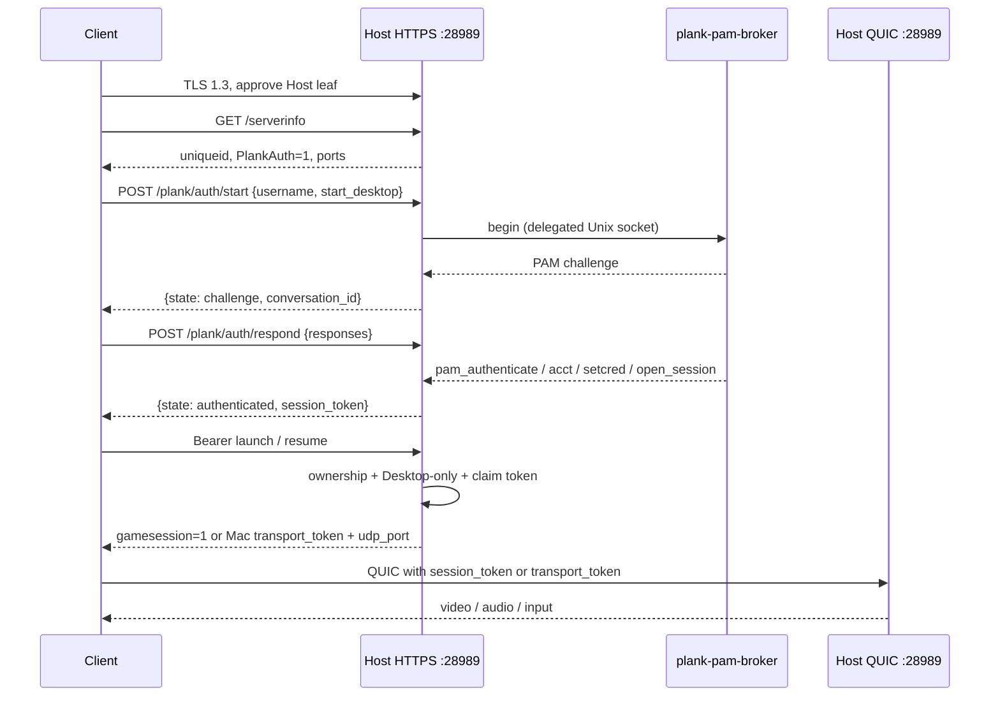
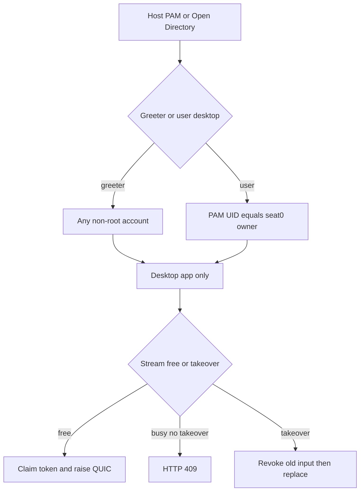
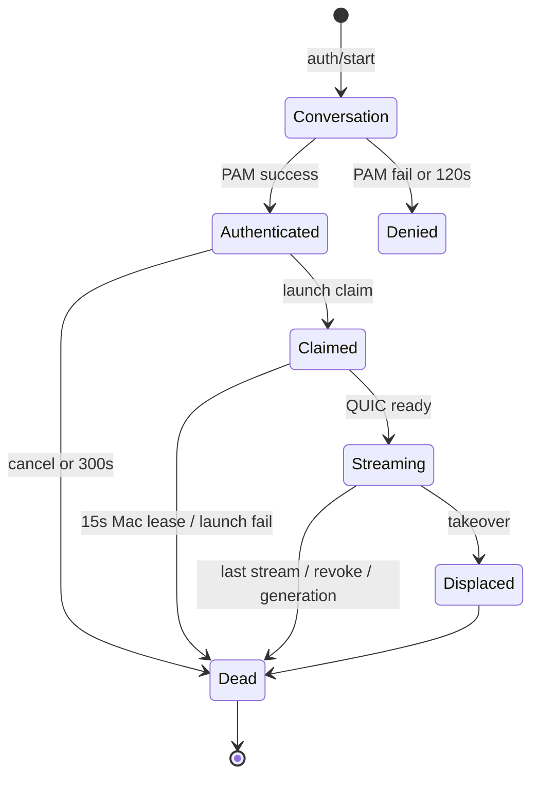

# PLANK Broker architecture review

**Status:** Read-only investigation. No code, branch, or protocol change.

**Date:** 2026-09-20

**Checkout:** `jgeehreng/plank` (fork of `instinctual/plank`), branch `uppercut/studio`, tip `e76cc92` (“host: keep the desktop running after Plank disconnect”).

**Rule:** The current repository is authoritative. Do not assume upstream Sunshine/Moonlight pairing, GameStream client-id, or ENet architecture.

**Goal:** Understand whether a separate PLANK Broker / control plane can later provide an HP Anyware-like workstation brokering experience for VFX facilities, without replacing the PLANK data plane.

**Non-goals:** Do not implement a broker. Do not proxy video/audio/input. Do not adopt Guacamole, MeshCentral, NICE DCV, or another remote-desktop stack unless a specific component is genuinely useful to PLANK (none found).

Intended eventual control-plane flow:

```
User → Identity Provider → Duo MFA → PLANK Broker
  → authorization / workstation allocation
  → short-lived admission
  → PLANK Client → PLANK Host
```

The broker must not proxy the video/audio/input data plane. Existing PLANK transport remains responsible for the VFX session.

---

## Term collisions

Three different things are called “broker” or look like one:

| Term | What it is | What it is not |
| --- | --- | --- |
| `plank-pam-broker` | Root Unix-socket PAM helper on the Host (`/run/plank/pam/auth.sock`) | A studio session directory |
| Facility / PCoIP-style broker | The missing product: allocate a workstation and issue admission | Present in 1.x |
| Kyber `ClientAuth` | QUIC application token (≤1 KiB) | Studio SSO or user identity |

Two different things are called “admission”:

| Term | Meaning |
| --- | --- |
| Mac machine admission | Machine process XPC-admits the graphical agent (generation + deadline) |
| Linux launch admission | Stream reservation from HTTP accept until QUIC setup |
| Future broker admission | A new short-lived workstation ticket (does not exist yet) |

On Mac, **authority** means `PLANKMacGraphicalAuthority`: a trusted console-owner snapshot with a generation that can only revoke. It is not a CA.

---

## 1. How does a PLANK client currently identify itself?

It does **not** present a cryptographic Client identity.

- No client certificate.
- No pairing secret.
- Host `uniqueid` / `uuid` query keys on `/serverinfo` are cache-busters. The Host does not treat them as a Client identity.
- After PAM, the Client holds an **in-memory Bearer `session_token`**. On the Host that token is bound to the **normalized TLS source IP**, not to a Client UUID.
- The bookmark stores **Host** `uniqueid`, address, and (on Mac) an optional cert SHA-256 pin.

The operator-typed OS username is a PAM account name, not a Client device identity. This fork’s Client branch is `uppercut/persist-username`; that only remembers the username locally.

Primary sources: `apps/client/app/backend/nvhttp.cpp` (`authenticate()`, `isPlankCertificate()`), `apps/client/app/backend/nvcomputer.cpp` (bookmark Host `uniqueid`).

## 2. How does a PLANK host identify itself?

Three stable identities, plus one process-local id:

| Identity | Where | Purpose |
| --- | --- | --- |
| Workstation UUID (`uniqueid`) | Linux `/var/lib/plank/plank-state.json`; Mac plist | Bookmark match. Survives worker replace. |
| TLS leaf | Linux `/etc/plank/tls/{cert,key}.pem` | HTTPS + QUIC server identity |
| FQDN in CN + DNS SAN | `scripts/maintenance/generate-plank-certificate.sh` | Cert profile the Client accepts |
| `PlankWorkerInstance` | Process-local UUID from `worker_instance_id()` | Detect media-worker replacement |

The machine supervisor, TLS files, and workstation UUID stay put when the media worker is replaced after a logind/X11 transition.

## 3. How is trust established between client and host?

**Profile + operator approval + Host PAM.** Not PKI, not pairing.

1. Host presents a self-signed RSA-3072 / SHA-256 leaf: DNS-only SAN, `CA:TRUE` pathlen 0, `serverAuth`.
2. Client requires TLS 1.3 and `isPlankCertificate()` (that profile). It does not walk a studio CA.
3. Operator approves the Host cert in the Client UI. Mac can pin SHA-256 for worker-replacement probes.
4. User identity is Host PAM (Linux) or Open Directory (Mac).

`protocol/authentication.md` is explicit: the Client does not classify the NIC. Network boundary is firewall/VPN policy, not PLANK.

## 4. How does the current handshake work?

HTTPS first, then QUIC on the same Host.



Steps in prose:

1. Client connects to the bookmark address on TCP 28989, TLS 1.3, and validates the Host leaf against the PLANK certificate profile.
2. `GET /serverinfo` returns workstation `uniqueid`, `PlankAuth=1`, and ports. Discovery does not disclose the active account or tokens.
3. `POST /plank/auth/start` with `{username, start_desktop}`.
4. `POST /plank/auth/respond` with `{conversation_id, responses}` (password in JSON body).
5. Success returns a 256-bit Bearer `session_token`.
6. Authenticated launch/resume claims that token and starts native QUIC on UDP 28989.

PLS1 (certificate-gated pre-session on QUIC, then PAM on that reliable endpoint) is reserved in `protocol/plank-transport`. The **current Client still authenticates over HTTPS**, then opens QUIC.

Mac launch schema 3 **consumes** the HTTP token and issues an independent one-use `transport_token`. Linux attaches the claimed PAM conversation to `launch_session_t` and uses that lifetime for the stream.

## 5. Where does authentication occur?

**On the Host only.**

Linux:

- The network-facing worker never links PAM.
- Root `plank-pam-broker` listens on `/run/plank/pam/auth.sock` (`0700`/`0600`, root-only).
- The supervisor connects and **delegates the fd** to the media worker. The worker never opens the broker path. There is no direct-connect fallback.
- Credentials stay on that delegated socket. The supervisor does not see the password.

Mac:

- `PLANKMacAuthenticationSession` runs Open Directory verification on a background auth queue.
- Passwords are not logged or retained. The object is not a socket.

There is no Client-side IdP, Duo, or facility-broker login in this tree.

## 6. Where does authorization occur?

After PAM, still on the Host, against the **live console**.

Linux (`account_authorized_for_desktop` / `supervisor_attests_account_for_active_seat0`):

- **Greeter:** any non-root PAM account.
- **User desktop:** PAM UID must equal the active seat0 owner.
- Enabling `security.allow_root_login` does **not** bypass ownership.
- No application user allowlist. HBAC is PAM/SSSD/FreeIPA.
- Launch/resume: Desktop app only; one stream; explicit takeover flag or HTTP 409.
- Display lease is bound to the PAM UID.

Mac (`plank_macos_account_may_attach`):

- Desktop admits only the owner (UID + account UUID).
- LoginWindow admits verified non-root users.
- Tokens must not be carried across graphical phases.
- Generation must match; a new generation is a new authority.

`confirmed_desktop_stage()` is UI/state only. It grants no access.

## 7. What is an “admission” in the current PLANK implementation?

**Not a facility workstation ticket.** Three local meanings exist today:

1. **Mac machine admission** — the machine process XPC-admits the graphical agent. Binds generation + deadline. Host will not start the runtime without it (`runtime-admission`).
2. **Linux launch admission** — `launch_session_pending()` reservation from HTTP accept until native QUIC setup succeeds or fails. Prevents a second client in the gap before media starts.
3. **Mac HTTPS admission** — connection/header/body watchdog (~5 s). Capacity: eight connections, one auth in flight.

A future broker “short-lived admission” would be a **new** object.

## 8. What is an “authority”?

On Mac, `PLANKMacGraphicalAuthority` / `PLANKMacGraphicalIdentity`:

- Trusted snapshot of the **console owner**, never deserialized from Client JSON.
- Fields: `active`, `generation`, account UID+UUID, phase (`SignIn` vs `Desktop`).
- Notifications can only **revoke**, never grant.
- Generation changes when graphical authority is revoked or replaced.

It is **not** a CA and **not** a studio policy engine.

Linux has no type named Authority. The equivalent is supervisor attestation of seat0 over the inherited `SOCK_SEQPACKET` channel.

## 9. How is session ownership represented?

| Layer | Linux | Mac |
| --- | --- | --- |
| OS account | PAM username → NSS UID | UID + account UUID |
| Console | logind seat0 descriptor + generation | Graphical identity + generation + phase |
| Network | Token ↔ normalized peer IP | Token ↔ accepted peer IP bytes |
| Stream | `launch_session_t` + shared PAM conversation | Process-local `PLANKMacStreamLease` |
| Display | `plank_display_lease_uid` | Permission + capture generation |

Stream leases are process-local. They are not logged, serialized, or persisted.

## 10. How are sessions created?

1. PAM succeeds → unclaimed Bearer token (300 s).
2. Launch/resume rechecks peer + ownership + Desktop-only.
3. `claim()` transfers PAM lifetime to the stream (Linux) or consumes the HTTP token and issues `transport_token` (Mac).
4. `launch_session_raise()` / Mac preview-session starts QUIC.
5. First successful launch can also start a user session (`start_desktop` / skip-GDM on this fork).

A later resume of the same PAM token is not possible after the last stream releases it. A new login is required.

## 11. How are sessions recovered?

Not by replaying a durable session id.

- The Client keeps the **password in memory** for the active stream.
- Reconnect overlay retries authentication up to ~20 s, then Host Timeout / “Keep Waiting” (`PlankReconnectPolicy`).
- Terminal statuses: 400/403/404/423; 401 if already authenticated. 409/425/429/5xx are retryable. Mac permission `403 host_permissions_required` stops auto-retry.
- Worker replacement: `probeWorkerReplacement()` requires a **new** `PlankWorkerInstance` and the **same** cert SHA-256. The probe uses no Bearer and no password.
- Mac generation change or token consume → new login.
- A local user disconnect does not auto-reconnect.

This fork’s `e76cc92` keeps the **OS desktop** running after Plank disconnect. That is occupancy, not token recovery.

## 12. How are sessions revoked?

- `web_auth_manager_t::cancel` / Mac `revokeToken` / `revokeAll`
- Last stream release closes PAM and invalidates the token
- Takeover: old input revoked, displaced-session reason, old stream joined, then replacement applied
- Display-lease end
- Mac graphical loss, permission loss, agent registry revoke
- Failed launch/topology delivery (cannot revoke another peer’s attempt)
- Supervisor replacing the media worker (new process; machine UUID/TLS stay)

Logout / seat change is a Host-side revoke of graphical attachment, not a broker command.

## 13. How do expiration / deadlines work?

| Clock | Lifetime | Effect |
| --- | --- | --- |
| PAM conversation | 120 s | Pending challenge dies |
| Unclaimed HTTP token | 300 s | Must launch before this |
| Mac pending stream lease | 15 s | Activation does not renew old tokens |
| Mac HTTPS watchdog | ~5 s | Connection closed |
| Mac OD verify bound | 4 s | Auth capacity, not token life |
| Client reconnect | Host Timeout / Keep Waiting | Password retry window |
| Host cert | 825 days (generate script) | TLS identity, not session |

Readiness HTTP 503 retains setup context but **does not extend** the 300 s expiry. No keepalive renews a token.

## 14. How are credentials represented and transported?

- Password: JSON POST body over TLS 1.3 (`/plank/auth/respond`). Client `SecureStringGuard`. Never in URLs, query strings, logs, argv, env, or settings.
- HTTP token: 256-bit CSPRNG, hex Bearer, `Cache-Control: no-store`.
- Mac `transport_token`: independent one-use QUIC secret after claim.
- Linux PAM session: open Unix-socket conversation held until last stream drops.
- Kyber `ClientAuth`: QUIC application token (≤1 KiB), not studio SSO.

## 15. Which keys / certificates are involved?

- **One Host RSA-3072 leaf** for HTTPS and QUIC. Same profile on Linux (`crypto::gen_creds` fallback) and the generate script.
- Private key `root:root` `0600`; cert world-readable.
- **No client cert, no pairing keys, no broker key, no session wrapping key** in the current product path.
- Kyber/Quinn use that Host leaf; on the PLS1 path the Client validates the peer leaf against the PLANK profile before enabling application queues.

## 16. What prevents a client from impersonating another user / host?

- **User:** PAM/OD on the Host. The token carries the authenticated username/UID. Ownership is rechecked at launch.
- **Peer:** token bound to the accepted TCP source. Forwarded headers are ignored. IPv4-mapped IPv6 is normalized.
- **Host:** bookmark `uniqueid` must match `/serverinfo`. Wrong machine → wrong workstation.
- **Cert:** operator-approved / pinned leaf. Replacement probe fails if the cert hash changes.
- **No client cert** means there is no stolen Client identity to present — and also no strong Client device auth today.
- Different accounts behind the same NAT remain independent (Mac: UUID+UID, not username).

A stolen **Bearer from the same IP** before claim is a real window (300 s). That is why the token is one-use and short-lived.

## 17. What assumptions require direct Client → Host connectivity?

From `README.md` Connectivity and the implementation:

1. The bookmark already contains a reachable `host:28989`.
2. Host peer identity **is** the TCP source of that connection.
3. Launch/resume never return a different host (Mac `udp_port` is the same Host).
4. QUIC uses that same Host identity and the same certificate.
5. Both TCP and UDP 28989 must work. No UPnP, no NAT helper, no directory, no media proxy.
6. VPN/LAN/WAN/port-forward is an **operator** problem.

## 18. What would have to change to support a broker?

Only the **control plane** around “which Host, and may this person try to log in.”

- New broker service (allocation, occupancy, short-lived admission).
- Client: ingest admission → one-shot bookmark (address, uniqueid, maybe pinned cert).
- Host: verify admission **before or beside** PAM; do not replace seat0 ownership.
- Directory of Host uniqueids / reachability / busy-or-free. Occupancy must account for this fork leaving the desktop up after disconnect.
- Decide MFA: Duo at broker vs Host PAM vs both.

Do **not** change kymux, NvFBC/VideoToolbox, Wacom, exact-format decode, or put media through the broker.

## 19. What should NOT change?

- Native QUIC/kymux data plane and FEC policy
- Exact-format encode/decode (no silent 4:2:0 / 8-bit substitution)
- Wacom raw-HID vs normalized pen fallback
- Host PAM / Open Directory as the desktop lock
- seat0 / graphical-generation ownership
- Desktop-only session
- No application user allowlist (HBAC stays in the OS)
- No UPnP, no ENet, no GameStream pairing restore
- Repo rule: only Host and Client in this public tree; a broker is a **separate** product
- Optional wake remains admin policy, not a Client magic-packet feature

---

## Architecture maps

### Current authorization



### Current session lifecycle



### Potential broker insertion (control plane only)


The broker never sees video, audio, or input.

---

## A. Existing architecture summary

Two products: Host and Client. Linux Host is a boot-persistent root supervisor plus a replaceable media worker. Mac Host is a machine process that XPC-admits a graphical agent. Control is HTTPS TLS 1.3 on TCP 28989. Data is native QUIC/kymux on UDP 28989. Discovery is a bookmark to a reachable address. `plank-pam-broker` is local PAM, not a session directory.

README Connectivity: the current workflow expects a direct connection. There is no broker. The operator provides VPN/LAN/WAN/port-forward. Default is TCP and UDP 28989.

## B. Existing security model

Self-signed Host leaf, operator-approved cert profile, TLS 1.3 only. User secrets go to Host PAM/OD on a private channel. Tokens are random, peer-IP-bound, short-lived, one-claim. No pairing store, no client cert, no application allowlist. Privilege split: supervisor attests seat; worker holds the stream; `plank-pam-broker` holds PAM.

## C. Existing session model

One controlling stream per workstation. Ownership is the live console, not a broker lease. Token dies on claim-complete or last-stream PAM close. Recovery is a new PAM login with an in-memory password. Takeover is explicit, same PAM owner. This fork keeps the OS desktop after Plank disconnect.

## D. Current direct-connection assumptions

The Client already knows `host:28989`. Host peer identity is the TCP source. Launch does not redirect. QUIC is the same Host and cert. Both TCP and UDP are required. No UPnP, no directory, no media hop.

## E. Proposed broker integration point

Insert the broker **before bookmark connect**, and optionally as a Host-side admission verify next to `web_auth` / `PLANKMacAuthenticationSession`.

- Broker: IdP + Duo → authorize → allocate workstation → issue short-lived admission + reachability.
- Client: turn that into a connect.
- Host: verify admission, then still run PAM and seat0 checks.
- Data plane: unchanged Client ↔ Host QUIC.

Do not build a PCoIP Security Gateway equivalent. Do not adopt Guacamole, MeshCentral, or NICE DCV; nothing in this tree needs their session or media stacks.

## F. Files / functions that would probably need modification

| Location | Why |
| --- | --- |
| `apps/host/linux/src/auth/web_auth.{h,cpp}` | Peer-bound conversations/tokens; `begin` / `authorize` / `claim` / `cancel` / `expire` |
| `apps/host/linux/src/nvhttp.cpp` | HTTPS start/respond, launch/resume, `authentication_peer`, `uniqueid` |
| `apps/host/linux/src/session/session_context.{h,cpp}` | seat0 eligibility, supervisor attestation, `start_desktop` |
| `apps/host/linux/src/session_stream.{h,cpp}` | Launch reservation and stream ownership |
| `apps/client/app/backend/nvhttp.cpp` | `isPlankCertificate`, `authenticate()`, `session_token` |
| `apps/client/app/backend/nvcomputer.cpp` | Bookmark Host uniqueid; no Client crypto identity |
| `apps/host/macos/auth/authentication-session.{h,m}` | HTTP token, transport lease, `revokeAll` |
| `apps/host/macos/auth/graphical-authority.{h,m}` | Console authority generation and latching revoke |
| `apps/host/macos/session/agent-connection.{h,m}` | Machine XPC admission of the graphical agent |
| `apps/host/macos/control/https-auth-server.m` | Launch claim path |
| `protocol/authentication.md` | Canonical PAM + HTTPS + TLS contract |
| `tests/auth/*`, `tests/protocol/macos-preview-launch*`, Linux `test_web_auth` | Contract tests |

## G. New components that would probably need to be created

| Component | Role |
| --- | --- |
| `plank-broker` service | Studio control plane: identity, allocation, admission issue |
| Admission credential | Short-lived, Host-verifiable, not a media token |
| Workstation directory | Host uniqueid, reachability, occupancy, owner policy |
| Client admission ingest | Turn broker result into a one-shot bookmark/connect |
| Host admission verifier | Accept a broker-issued ticket before or beside PAM |
| IdP / Duo integration | Lives in the broker, not in Host/Client media paths |

`AGENTS.md`: only Host and Client belong in this public tree. A broker is a separate product, not a submodule of private infrastructure.

## H. Security risks

1. **Admission replaces PAM** — HBAC and seat ownership disappear.
2. **Broker becomes the TCP peer** — today’s IP-bound tokens break or, worse, bind to the broker.
3. **Stolen facility ticket** that can launch without PAM.
4. **Media-plane proxy** — latency, MTU, and a second session stack.
5. **Directory leakage** — Mac `/serverinfo` already refuses account/session disclosure.
6. **MFA twice or never** — Duo + Host 2FA fails artists; Duo-only fails OS policy.
7. **Occupancy lie** — desktop still running after disconnect on this fork.

## I. Open questions

| Question | Priority |
| --- | --- |
| Is broker admission a permission to attempt Host PAM, or a substitute for Host PAM? | High |
| Does the Client already have a route to the Host, or must the broker return a new address? | High |
| Who signs the ticket: broker key, Host-pre-shared secret, or mutual TLS? | High |
| Does allocation include power-on / `start_desktop` / skip-GDM, or only directory? | Medium |
| How is “busy” defined when the desktop stays up after Plank disconnect? | Medium |
| One admission schema for Linux and Mac, or platform-specific claims? | Medium |
| Does Duo at the broker satisfy studio policy if Host PAM still prompts? | Medium |

## J. Recommended next step

**Write the admission contract, not the service.**

Decide whether broker admission is a permission to attempt Host PAM or a substitute for Host PAM. Draft the ticket fields (issuer, Host uniqueid, account, expiry, reachability) and the Host verify hook next to `web_auth` / `PLANKMacAuthenticationSession`. Keep QUIC, capture, and input untouched.

---

## Primary sources

- `README.md` (Connectivity: no broker; TCP/UDP 28989)
- `HANDOFF.md` (release state; this review is not a handoff update)
- `AGENTS.md` (Host/Client-only public tree; no UPnP; PAM/ownership rules)
- `protocol/authentication.md`
- `protocol/macos-preview-launch.md`
- `protocol/plank-transport/README.md`
- `docs/architecture/host-session-supervisor.md`
- `docs/architecture/macos-control-plane.md`
- `docs/architecture/macos-authentication.md`
- `docs/architecture/macos-session-lifecycle.md`
- `docs/security/pam-qualification.md`
- Linux: `apps/host/linux/src/auth/web_auth.{h,cpp}`, `nvhttp.cpp`, `session/session_context.{h,cpp}`, `session_stream.{h,cpp}`, `httpcommon.cpp`
- Mac: `apps/host/macos/auth/authentication-session.{h,m}`, `graphical-authority.{h,m}`, `account-policy.h`, `session/agent-connection.{h,m}`, `control/https-auth-server.m`
- Client: `apps/client/app/backend/nvhttp.cpp`, `nvcomputer.cpp`, `hostrecovery.h`
- Tests: `tests/auth/client-reconnect-policy.cpp`, `tests/session/test-session-policy.cpp`

This file is an investigation note for review. It is not a protocol change and was not implemented.
